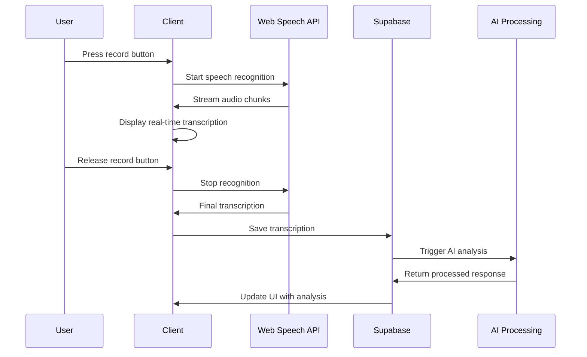

# Technical Architecture

## System Overview

<lov-mermaid>
graph TB
    subgraph "Client Layer"
        A[React Frontend]
        B[Voice Interface]
        C[PDF Generator]
    end
    
    subgraph "API Layer"
        D[Supabase Auth]
        E[Edge Functions]
        F[Real-time API]
    end
    
    subgraph "Processing Layer"
        G[OpenAI GPT-4]
        H[Web Speech API]
        I[Email Service]
    end
    
    subgraph "Data Layer"
        J[(Supabase Database)]
        K[File Storage]
        L[Session Storage]
    end
    
    A --> D
    A --> E
    A --> F
    B --> H
    C --> K
    E --> G
    E --> I
    E --> J
    F --> J
    
    style A fill:#e1f5fe
    style G fill:#fff3e0
    style J fill:#f3e5f5
</lov-mermaid>

## Tech Stack

### Frontend
- **Framework**: React 18 with TypeScript
- **Build Tool**: Vite for fast development and building
- **Styling**: Tailwind CSS with custom design system
- **UI Components**: shadcn/ui component library
- **State Management**: React Query for server state, React Context for app state
- **Routing**: React Router v6 for client-side routing

### Backend Infrastructure
- **BaaS**: Supabase for authentication, database, and real-time features
- **Database**: PostgreSQL (via Supabase)
- **Authentication**: Supabase Auth with email/password and social providers
- **File Storage**: Supabase Storage for PDFs and audio files
- **Edge Functions**: Supabase Edge Functions for serverless compute

### AI and Processing
- **AI Provider**: OpenAI API (GPT-4) for conversation analysis
- **Voice Processing**: Web Speech API for browser-native speech recognition
- **PDF Generation**: jsPDF for client-side PDF creation
- **Email**: Resend via Supabase Edge Functions for report delivery

### Development Tools
- **Package Manager**: npm
- **Code Quality**: ESLint, Prettier, TypeScript strict mode
- **Testing**: Vitest for unit tests, Playwright for E2E
- **Deployment**: Vercel for frontend, Supabase for backend

## Data Models

### Users Table
```sql
CREATE TABLE users (
    id uuid PRIMARY KEY DEFAULT gen_random_uuid(),
    email text UNIQUE NOT NULL,
    created_at timestamp with time zone DEFAULT now(),
    updated_at timestamp with time zone DEFAULT now(),
    business_name text,
    industry text,
    company_size text,
    role text,
    phone text,
    preferences jsonb DEFAULT '{}'::jsonb
);
```

### Assessments Table
```sql
CREATE TABLE assessments (
    id uuid PRIMARY KEY DEFAULT gen_random_uuid(),
    user_id uuid REFERENCES users(id) ON DELETE CASCADE,
    status assessment_status DEFAULT 'in_progress',
    responses jsonb DEFAULT '{}'::jsonb,
    ai_analysis jsonb,
    created_at timestamp with time zone DEFAULT now(),
    completed_at timestamp with time zone,
    session_duration integer,
    voice_enabled boolean DEFAULT true,
    language text DEFAULT 'en'
);

CREATE TYPE assessment_status AS ENUM ('in_progress', 'completed', 'abandoned');
```

### Reports Table
```sql
CREATE TABLE reports (
    id uuid PRIMARY KEY DEFAULT gen_random_uuid(),
    assessment_id uuid REFERENCES assessments(id) ON DELETE CASCADE,
    user_id uuid REFERENCES users(id) ON DELETE CASCADE,
    content jsonb NOT NULL,
    pdf_url text,
    shared_count integer DEFAULT 0,
    last_accessed timestamp with time zone DEFAULT now(),
    created_at timestamp with time zone DEFAULT now(),
    expires_at timestamp with time zone
);
```

### Voice Recordings Table
```sql
CREATE TABLE voice_recordings (
    id uuid PRIMARY KEY DEFAULT gen_random_uuid(),
    assessment_id uuid REFERENCES assessments(id) ON DELETE CASCADE,
    question_id text NOT NULL,
    audio_url text,
    transcription text,
    confidence_score real,
    duration integer,
    created_at timestamp with time zone DEFAULT now()
);
```

### Analytics Table
```sql
CREATE TABLE analytics_events (
    id uuid PRIMARY KEY DEFAULT gen_random_uuid(),
    user_id uuid REFERENCES users(id) ON DELETE SET NULL,
    assessment_id uuid REFERENCES assessments(id) ON DELETE SET NULL,
    event_type text NOT NULL,
    event_data jsonb DEFAULT '{}'::jsonb,
    created_at timestamp with time zone DEFAULT now(),
    session_id text,
    user_agent text,
    ip_address inet
);
```

## API Structure

### Authentication Endpoints
- `POST /auth/signup` - User registration
- `POST /auth/signin` - User login
- `POST /auth/signout` - User logout
- `GET /auth/user` - Get current user
- `PUT /auth/user` - Update user profile

### Assessment Endpoints
- `POST /assessments` - Create new assessment
- `GET /assessments/:id` - Get assessment by ID
- `PUT /assessments/:id` - Update assessment responses
- `POST /assessments/:id/complete` - Mark assessment as complete
- `DELETE /assessments/:id` - Delete assessment

### Voice Processing Endpoints (Edge Functions)
- `POST /functions/v1/process-voice` - Process voice recording
- `POST /functions/v1/transcribe` - Transcribe audio to text
- `GET /functions/v1/voice-status/:id` - Check processing status

### Report Generation Endpoints (Edge Functions)
- `POST /functions/v1/generate-report` - Generate AI analysis and report
- `GET /functions/v1/reports/:id` - Get report by ID
- `POST /functions/v1/reports/:id/pdf` - Generate PDF version
- `POST /functions/v1/reports/:id/email` - Email report to user

### Analytics Endpoints
- `POST /functions/v1/analytics/track` - Track user events
- `GET /functions/v1/analytics/dashboard` - Get analytics dashboard (admin)

## Voice Interface Architecture

### Recording Flow


### Voice Processing Pipeline
1. **Capture**: Web Speech API captures audio in real-time
2. **Transcription**: Browser-native speech-to-text conversion
3. **Validation**: Confidence scoring and error handling
4. **Storage**: Audio files and transcriptions saved to Supabase
5. **Processing**: AI analysis of transcribed content
6. **Feedback**: Real-time updates to user interface

### Error Handling
- **Low confidence transcription**: Prompt user to repeat
- **Network issues**: Offline storage with sync when online
- **Browser compatibility**: Graceful fallback to text input
- **Audio quality**: Noise detection and quality indicators

## Security Considerations

### Authentication Security
- **Row Level Security (RLS)**: All database tables protected with RLS policies
- **JWT tokens**: Secure session management with automatic refresh
- **Password requirements**: Minimum 8 characters with complexity rules
- **Rate limiting**: API rate limiting to prevent abuse

### Data Protection
- **Encryption**: All data encrypted in transit (TLS 1.3) and at rest (AES-256)
- **Input sanitization**: All user inputs sanitized to prevent XSS/injection
- **CORS configuration**: Strict CORS policies for API access
- **Privacy compliance**: GDPR and CCPA compliant data handling

### API Security
- **Authentication**: All endpoints require valid JWT tokens
- **Authorization**: User-specific data access controls
- **Request validation**: Input validation on all API endpoints
- **Audit logging**: Comprehensive logging of all user actions

## Performance Optimization

### Frontend Performance
- **Code splitting**: Route-based code splitting for optimal loading
- **Image optimization**: WebP format with fallbacks
- **Caching**: Service worker for offline functionality
- **Lazy loading**: Components and routes loaded on demand

### Backend Performance
- **Database indexing**: Optimized indexes for common query patterns
- **Connection pooling**: Efficient database connection management
- **CDN**: Global content delivery for static assets
- **Edge functions**: Serverless compute for scalable processing

### Monitoring and Analytics
- **Error tracking**: Comprehensive error monitoring and alerting
- **Performance monitoring**: Real-time performance metrics
- **User analytics**: Privacy-compliant user behavior tracking
- **Uptime monitoring**: 24/7 system availability monitoring

## Deployment Architecture

### Development Environment
- **Local development**: Vite dev server with hot reload
- **Local Supabase**: Docker-based local Supabase instance
- **Environment variables**: Secure configuration management

### Staging Environment
- **Preview deployments**: Automatic Vercel preview for all PRs
- **Staging database**: Separate Supabase project for staging
- **E2E testing**: Automated testing on staging deployments

### Production Environment
- **Frontend hosting**: Vercel with global CDN
- **Backend infrastructure**: Supabase managed services
- **Custom domain**: SSL certificate with automatic renewal
- **Monitoring**: Comprehensive logging and alerting

## Scalability Considerations

### Horizontal Scaling
- **Stateless design**: No server-side session state
- **Database scaling**: Supabase automatic scaling
- **CDN distribution**: Global content delivery
- **Edge functions**: Auto-scaling serverless compute

### Performance Limits
- **Concurrent users**: 1000+ simultaneous assessments
- **Database operations**: 10,000+ queries per minute
- **File storage**: Unlimited with Supabase
- **API rate limits**: 100 requests per minute per user

### Future Scaling Plans
- **Microservices**: Break down into smaller services as needed
- **Caching layer**: Redis for high-frequency data
- **Load balancing**: Multiple region deployment
- **Database sharding**: Horizontal database scaling if needed